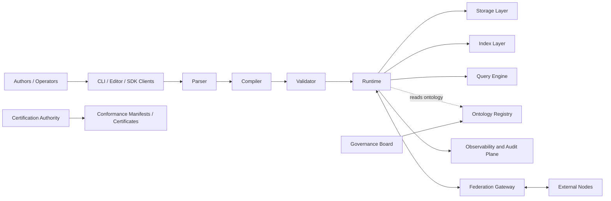
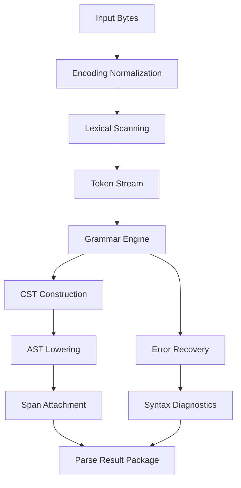
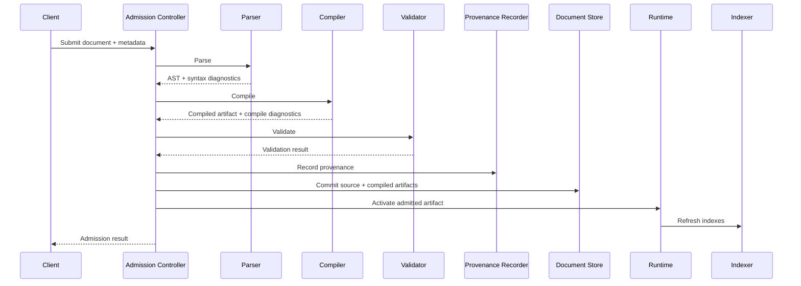

# Atrahasis AASL Diagram and Visual Packs
## Canonical System, Flow, Sequence, Governance, and Certification Diagram Specification Set

**Document ID:** AASL-DIAGRAM-PACK-001  
**Status:** Canonical Visual Architecture Specification  
**Scope:** System architecture diagram set; parser/compiler/runtime flow diagrams; storage/query/federation sequence diagrams; governance lifecycle diagrams; certification workflow diagrams  
**Intended Audience:** Architects, platform engineers, runtime implementers, tooling teams, certification authorities, ontology stewards, standards editors, SDK teams, integrators  

---

## 1. Purpose and Role of This Document

This document defines the complete canonical visual and diagrammatic pack for the Atrahasis Agent Semantic Language (AASL) ecosystem. It is intentionally written as a narrative and structured specification rather than as a rendered image bundle so that it can serve as the authoritative source for later generation of PNG, SVG, Mermaid, PlantUML, Draw.io, Visio, Figma, D2, Graphviz, and documentation-embedded diagrams.

The goal is not merely to list suggested graphics. The goal is to define, precisely and unambiguously, what the official visual system of AASL must communicate, which diagrams are normative, how each diagram is scoped, what each node and edge means, which actor boundaries are mandatory, what failure paths must appear, and how the entire documentation corpus should reuse a single visual vocabulary.

This file therefore functions as all of the following at once:

1. The canonical AASL visual architecture specification.
2. The diagram inventory for all core AASL domains.
3. The semantic legend standard for future diagrams.
4. The rendering guidance for downstream tooling and design systems.
5. The traceable diagram-to-document mapping layer for the broader AASL doc set.

---

## 2. Document Objectives

This diagram pack exists to accomplish five operational objectives.

First, it gives every implementer a shared, system-level understanding of how AASL fits together across parsing, compilation, validation, runtime execution, storage, querying, federation, governance, and certification.

Second, it provides a repeatable visualization standard so different teams do not produce contradictory diagrams that drift away from the canonical specification.

Third, it defines sequence-level behavior, not only static architecture. That is essential because many AASL failure modes emerge from ordering, lifecycle, retry, rollback, concurrency, and federation timing rather than from static component relationships.

Fourth, it creates a diagram plan that can be transformed into actual deliverables. This document is intentionally specific enough that a diagram authoring team or automated renderer can create the visual pack directly from this source.

Fifth, it creates the official visual bridge between technical documentation and operational adoption. Leadership, contributors, standards board members, and implementation partners will often absorb system behavior more quickly through sequence diagrams and lifecycle views than through prose specifications alone.

---

## 3. Scope

This document covers the following required visual domains:

- System architecture diagram set
- Parser/compiler/runtime flow diagrams
- Storage/query/federation sequence diagrams
- Governance lifecycle diagrams
- Certification workflow diagrams

This document does not attempt to fully replace the subsystem specifications. Instead, it extracts their most important relationships, flows, and lifecycle states into authoritative diagram definitions.

---

## 4. Diagram Design Principles

All official AASL diagrams derived from this document shall follow the same design principles.

### 4.1 Canonical over decorative

Diagrams are architectural instruments, not marketing art. Every box, arrow, state, swimlane, and annotation must map to a real concept in the specification corpus.

### 4.2 Stable semantics

A component must not change meaning from one diagram to another. If a "Document Store" node appears in three diagrams, it must represent the same conceptual boundary unless explicitly marked as a narrowed local view.

### 4.3 Explicit trust and authority boundaries

Every diagram involving write paths, federation, or certification must visibly distinguish actor authority boundaries, trust zones, and validation gates.

### 4.4 Failure-aware depiction

Success-only diagrams are insufficient. Where failures are architecturally meaningful, the diagram definition must include rejection, rollback, retry, quarantine, fallback, or escalation paths.

### 4.5 Layered readability

Every complex diagram should be renderable in at least three levels:

- Executive/system overview
- Engineering/control-flow view
- Deep implementation view

### 4.6 Text-first renderability

Each official diagram should be renderable from textual definitions so the visual system remains versionable and diffable in source control.

---

## 5. Canonical Visual Vocabulary

This section defines the required semantic legend for all future AASL diagrams.

### 5.1 Node types

**Actor**  
Represents a human or machine principal that initiates or receives actions.

**Client Tool**  
Represents editor plugins, CLI, SDK-based applications, or ingestion utilities.

**Service**  
Represents an active software component with an API, control loop, or orchestration function.

**Store**  
Represents a persistence boundary, durable log, registry, object store, or index.

**Pipeline Stage**  
Represents a transformation stage in a flow-oriented diagram.

**Policy Gate**  
Represents validation, authorization, certification, governance, or review gates.

**Artifact**  
Represents a document, schema, manifest, ontology package, compiled object, fixture, report, or certificate.

**External System**  
Represents a system outside the authoritative AASL trust/control domain.

### 5.2 Edge types

**Solid directional arrow**  
Primary control or data flow.

**Dashed directional arrow**  
Optional, asynchronous, advisory, or derived flow.

**Double-line arrow**  
Durable commit or authoritative state transition.

**Bidirectional arrow**  
Negotiation, synchronization, or protocol exchange.

**Dotted dependency line**  
Reference, dependency, or lookup relationship without direct control ownership.

### 5.3 Boundary types

**Trust Boundary**  
Separates domains where identity, authority, or provenance cannot be assumed to remain continuous.

**Execution Boundary**  
Separates independently deployable/runtime components.

**Governance Boundary**  
Separates systems and actors subject to standards decisions from ordinary runtime operators.

**Certification Boundary**  
Separates candidate implementations from certifying authorities and official artifact issuers.

### 5.4 State colors and shape conventions

This markdown specification is color-agnostic, but all visual renderings should preserve state distinctiveness using both color and shape. Renderings must remain understandable in monochrome and accessible modes.

Recommended state semantics:

- Draft / proposed
- Pending review
- Admitted / active
- Deprecated
- Suspended / quarantined
- Rejected / invalid
- Certified
- Revoked

---

## 6. Master Diagram Inventory

The official visual pack shall contain at minimum the following canonical diagrams.

### 6.1 System architecture diagrams

1. AASL Ecosystem Top-Level Architecture
2. AASL Authoring and Ingestion Architecture
3. AASL Runtime and Execution Architecture
4. AASL Storage and Indexing Architecture
5. AASL Federation and External Exchange Architecture
6. AASL Governance and Certification Meta-Architecture

### 6.2 Flow diagrams

7. Parser Internal Flow
8. Compiler Transformation Flow
9. Validator Pass Flow
10. Runtime Resolution and Execution Flow
11. End-to-End Authoring-to-Execution Flow

### 6.3 Sequence diagrams

12. Document Admission Sequence
13. Query Execution Sequence
14. Federation Publish Sequence
15. Federation Import Sequence
16. Cross-Node Query Federation Sequence
17. Failure and Rollback Sequence for Invalid Admissions

### 6.4 Governance lifecycle diagrams

18. Ontology Proposal Lifecycle
19. Namespace Registration Lifecycle
20. Deprecation and Compatibility Lifecycle
21. RFC Lifecycle
22. Emergency Governance Override Lifecycle

### 6.5 Certification workflow diagrams

23. Implementation Certification Workflow
24. Conformance Test Submission Workflow
25. Certificate Issuance and Revocation Workflow
26. Interop Event Workflow
27. Continuous Certification Renewal Workflow

---

## 7. System Architecture Diagram Set

## 7.1 Diagram 1: AASL Ecosystem Top-Level Architecture

### 7.1.1 Purpose

This diagram presents the highest-level official view of the AASL ecosystem. It is the single diagram that should appear first in broad system documentation, onboarding decks, external briefings, and master architecture documentation.

### 7.1.2 Required components

The diagram must include the following nodes:

- Authors / Operators / Developers
- CLI / Editor / SDK Clients
- Parser
- Compiler
- Validator
- Runtime
- Query Engine
- Storage Layer
- Index Layer
- Ontology Registry
- Governance Board / Standards Authority
- Certification Authority
- Federation Gateway
- External Nodes / Partner Implementations
- Observability and Audit Plane

### 7.1.3 Required relationships

The diagram must show:

- Authoring tools submitting documents and commands into the language toolchain
- Parser, compiler, and validator forming the admission path
- Runtime consuming admitted artifacts and registry state
- Query engine reading runtime state, indexes, and storage
- Federation gateway exchanging artifacts and manifests with external nodes
- Governance board influencing ontology registry and standards artifacts
- Certification authority validating implementations against test suites and manifests
- Observability plane receiving events from the runtime, storage, query engine, and federation gateway

### 7.1.4 Required boundaries

The following boundaries must appear:

- User/client boundary
- Toolchain boundary
- Runtime/storage boundary
- Governance/certification boundary
- External federation boundary

### 7.1.5 Core interpretation

The diagram should make one architectural truth visually obvious: AASL is not merely a file format. It is a governed semantic system spanning authoring, compilation, validation, execution, storage, query, exchange, and certification.

### 7.1.6 Suggested Mermaid skeleton



---

## 7.2 Diagram 2: AASL Authoring and Ingestion Architecture

### 7.2.1 Purpose

This diagram narrows the view to the document-authoring and admission path from source creation to stored admissible artifact.

### 7.2.2 Required components

- Human author
- IDE/VS Code extension
- Formatter
- Linter / static analyzer
- Parser
- AST/CST builder
- Compiler
- Validator
- Admission controller
- Document store
- Error catalog and diagnostics channel
- Provenance recorder

### 7.2.3 Required flow

The diagram must illustrate:

- Author edits source
- Tooling performs format and lint assistance pre-submit
- Parser builds CST/AST and emits syntax diagnostics
- Compiler resolves semantic structure and enriches representations
- Validator performs layered checks
- Admission controller either accepts, rejects, or quarantines
- Provenance recorder stores source origin, identity, signatures, timestamps, and compile metadata

### 7.2.4 Failure paths

The diagram must show at least three failure categories:

- Parse failure returning syntax diagnostics to the authoring client
- Validation failure returning structured error codes and non-admission outcome
- Partial ambiguity or policy-triggered quarantine leading to human review

---

## 7.3 Diagram 3: AASL Runtime and Execution Architecture

### 7.3.1 Purpose

This diagram depicts how admitted AASL artifacts become executable semantic state inside the runtime.

### 7.3.2 Required components

- Runtime admission view
- Resolver
- Identity and reference manager
- Semantic object registry
- Namespace loader
- Policy engine
- Transaction manager
- Event emitter
- State snapshot manager
- Audit log
- Query subscription bridge

### 7.3.3 Required interpretation

The runtime is not a passive file reader. It is a stateful semantic machine that resolves references, enforces policies, applies controlled mutations, emits events, and exposes queryable state.

### 7.3.4 Mandatory annotations

The diagram must annotate:

- Mutable vs immutable state
- Authoritative vs derived state
- Transactional vs non-transactional side effects
- Synchronous vs asynchronous event emission

---

## 7.4 Diagram 4: AASL Storage and Indexing Architecture

### 7.4.1 Purpose

This diagram explains how canonical documents, compiled artifacts, indexes, manifests, logs, and snapshots are stored and related.

### 7.4.2 Required components

- Canonical source document store
- Compiled object store
- Binary fixture store (.aasb)
- Manifest store
- Error/diagnostic store
- Event log
- Audit log
- Query indexes
- Federation export cache
- Backup / snapshot archive

### 7.4.3 Required relationships

The diagram must show:

- Source-to-compiled traceability
- Compiled-to-index derivation
- Admission-to-manifest linkage
- Runtime events feeding event/audit logs
- Export cache materialized from admitted documents and federation policies

---

## 7.5 Diagram 5: AASL Federation and External Exchange Architecture

### 7.5.1 Purpose

This diagram shows how one AASL node interoperates with external nodes, partner systems, and other implementations.

### 7.5.2 Required components

- Local federation gateway
- Identity and trust anchor bundle
- Export policy engine
- Import validation engine
- Remote node(s)
- External schema or adapter layer
- Provenance verifier
- Signature verifier
- Conflict/quarantine queue
- Federation audit log

### 7.5.3 Required questions answered by the diagram

The viewer must understand:

- What leaves the node
- What enters the node
- Which policies are evaluated before exchange
- How remote trust is established
- Where conflicts and incompatible ontology imports are handled

---

## 7.6 Diagram 6: AASL Governance and Certification Meta-Architecture

### 7.6.1 Purpose

This diagram portrays the standards-level control plane above implementation instances.

### 7.6.2 Required components

- Standards board / governance authority
- RFC process system
- Ontology review board
- Namespace registry service
- Conformance suite maintainer
- Certification authority
- Implementer community
- Official documentation corpus
- Release registry
- Revocation and advisory channel

### 7.6.3 Required interpretation

This diagram must make it clear that governance is a first-class system and that certification, deprecation, namespace approval, and conformance evolution are managed processes rather than ad hoc decisions.

---

## 8. Parser / Compiler / Runtime Flow Diagrams

## 8.1 Diagram 7: Parser Internal Flow

### 8.1.1 Purpose

The parser flow diagram shows the stepwise internal mechanics of parsing an AASL document from bytes to syntax tree and diagnostic result.

### 8.1.2 Required stages

- Input bytes
- Encoding normalization
- Lexical scanning
- Token stream production
- Parser state machine / grammar engine
- CST construction
- AST lowering
- Span attachment
- Error recovery stage
- Syntax diagnostic emission
- Parse result packaging

### 8.1.3 Required branching

The flow must show:

- Clean parse path
- Recoverable parse path
- Non-recoverable parse path
- Ambiguous structure handling where applicable

### 8.1.4 Required outputs

- AST/CST bundle
- Token trace
- Source span map
- Syntax diagnostics
- Parse admissibility flag

### 8.1.5 Suggested Mermaid skeleton



---

## 8.2 Diagram 8: Compiler Transformation Flow

### 8.2.1 Purpose

This diagram shows how parser output becomes compiled semantic representation suitable for validation, storage, and runtime admission.

### 8.2.2 Required stages

- AST input
- Symbol discovery
- Namespace resolution
- Reference resolution
- Type/shape interpretation
- Ontology mapping
- Identity assignment
- Canonicalization
- Intermediate representation generation
- Compile diagnostics
- Compile artifact packaging

### 8.2.3 Required failure or deviation points

- Missing namespace
- Unknown type or shape
- Non-unique identity
- Semantic ambiguity
- Ontology mismatch
- Inadmissible canonicalization conflict

### 8.2.4 Required outputs

- Compiled semantic graph/object set
- Symbol table
- Reference map
- Canonical representation
- Compile trace
- Compiler diagnostics

---

## 8.3 Diagram 9: Validator Pass Flow

### 8.3.1 Purpose

The validator flow diagram explains layered validation instead of treating validation as a single black box.

### 8.3.2 Required passes

- Structural validation
- Schema/shape validation
- Semantic validation
- Referential integrity validation
- Policy validation
- Namespace/governance validation
- Security/provenance validation
- Interoperability profile validation
- Certification profile validation

### 8.3.3 Required outputs

- Pass/fail per layer
- Severity-classed diagnostics
- Repair recommendations
- Admission recommendation
- Quarantine recommendation if applicable

### 8.3.4 Required visual treatment

This should be a stacked pipeline with clear gate semantics so viewers understand that some failures are fatal, some are warnings, and some produce conditional admission.

---

## 8.4 Diagram 10: Runtime Resolution and Execution Flow

### 8.4.1 Purpose

This diagram shows how a validated artifact becomes active runtime state and, where applicable, participates in execution, mutation, queryability, and event production.

### 8.4.2 Required stages

- Admission input
- Namespace/module load
- Reference graph hydration
- Identity registry synchronization
- Policy attachment
- Transaction open
- State apply
- Event emission
- Index refresh or invalidation
- Snapshot update
- Transaction commit or rollback

### 8.4.3 Mandatory failure branches

- Runtime reference hydration failure
- Policy conflict during apply
- Transaction failure during state update
- Event emission failure with retry policy note
- Rollback and quarantine path

---

## 8.5 Diagram 11: End-to-End Authoring-to-Execution Flow

### 8.5.1 Purpose

This is one of the highest-value diagrams in the full pack. It shows the full lifecycle from author action to active runtime state.

### 8.5.2 Required stages

- Author edits document
- Local format/lint assist
- Parse
- Compile
- Validate
- Admit
- Store source and compiled artifact
- Load into runtime
- Refresh indexes
- Query becomes available
- Federation export eligibility determination
- Observability event capture

### 8.5.3 Required overlays

The diagram must visually distinguish:

- Author-time actions
- Admission-time actions
- Runtime-time actions
- Asynchronous post-admission actions

---

## 9. Storage / Query / Federation Sequence Diagrams

## 9.1 Diagram 12: Document Admission Sequence

### 9.1.1 Purpose

This sequence diagram defines the canonical interaction sequence when a client submits a new or updated document for admission.

### 9.1.2 Required participants

- Authoring Client
- Admission API / Controller
- Parser
- Compiler
- Validator
- Provenance Recorder
- Document Store
- Runtime
- Indexer
- Diagnostics Service

### 9.1.3 Required sequence

1. Client submits document and metadata.
2. Admission controller records request context.
3. Parser parses the document.
4. Compiler transforms parse result.
5. Validator performs layered validation.
6. Provenance recorder stores source context.
7. On success, document store commits source and compiled artifacts.
8. Runtime is notified to load/adopt state.
9. Indexer refreshes affected indexes.
10. Diagnostics service returns final structured outcome.

### 9.1.4 Mandatory alternatives

At minimum include alt blocks for:

- Parse failure
- Validation rejection
- Quarantine/manual review
- Runtime post-admission failure causing rollback or degraded activation

### 9.1.5 Suggested Mermaid skeleton



---

## 9.2 Diagram 13: Query Execution Sequence

### 9.2.1 Purpose

This diagram defines the standard execution path for query requests.

### 9.2.2 Required participants

- Query Client
- Query API
- Query Planner
- Runtime Semantic Registry
- Index Store
- Document Store
- Authorization/Policy Layer
- Result Encoder
- Audit Log

### 9.2.3 Required sequence

- Client submits query with context and optional profile.
- Policy layer checks authorization and visibility.
- Query planner selects execution strategy.
- Planner consults index store for eligible acceleration paths.
- Runtime registry provides current semantic state.
- Document store may be consulted for source-linked details or non-indexed fields.
- Result encoder serializes output.
- Audit log records query metadata and outcome.

### 9.2.4 Required alternative paths

- Unauthorized query
- Partial result due to degraded index state
- Query timeout
- Federated continuation branch

---

## 9.3 Diagram 14: Federation Publish Sequence

### 9.3.1 Purpose

Shows the official process by which local artifacts are published to a remote node or federation partner.

### 9.3.2 Required participants

- Local Runtime / Export Initiator
- Export Policy Engine
- Federation Gateway
- Signature/Identity Service
- Remote Gateway
- Remote Import Validator
- Federation Audit Logs (local and remote)

### 9.3.3 Required sequence

- Export initiator selects candidate artifact set.
- Export policy engine checks permission, visibility, namespace eligibility, and profile compatibility.
- Gateway packages manifest and payload.
- Signature service signs package.
- Remote gateway receives package.
- Remote validator performs trust and compatibility checks.
- Remote node accepts, rejects, or quarantines.
- Both ends record audit events.

---

## 9.4 Diagram 15: Federation Import Sequence

### 9.4.1 Purpose

Shows how inbound remote artifacts are handled.

### 9.4.2 Required participants

- Remote Publisher
- Local Federation Gateway
- Trust Verifier
- Signature Verifier
- Ontology Compatibility Engine
- Validator
- Quarantine Queue
- Admission Controller
- Local Runtime

### 9.4.3 Required alternative paths

- Signature invalid
- Unknown trust anchor
- Namespace conflict
- Compatibility downgrade
- Manual review quarantine
- Successful localized import and activation

---

## 9.5 Diagram 16: Cross-Node Query Federation Sequence

### 9.5.1 Purpose

Defines how one node may execute a query that requires continuation to federated peers or partner nodes.

### 9.5.2 Required participants

- Local Query Client
- Local Query Planner
- Local Federation Broker
- Remote Query Endpoint(s)
- Local Result Merger
- Policy and provenance annotator

### 9.5.3 Required semantics

The sequence must show:

- Local plan decomposition
- Remote eligibility decision
- Remote subquery dispatch
- Result provenance tagging
- Merge/reconcile step
- Partial failure handling
- Final response with origin annotations

---

## 9.6 Diagram 17: Failure and Rollback Sequence for Invalid Admissions

### 9.6.1 Purpose

This diagram is mandatory because it visualizes one of the most important architectural safety patterns in the entire AASL system: admission failure and rollback after partial progress.

### 9.6.2 Required participants

- Admission Controller
- Runtime Transaction Manager
- Document Store
- Indexer
- Audit Log
- Alerting/Observability Plane
- Quarantine Store

### 9.6.3 Required sequence

- Admission begins.
- Some durable writes may have occurred in staging scope.
- Runtime activation fails or post-activation invariant breaks.
- Transaction manager triggers rollback.
- Staged material is reverted or moved to quarantine.
- Index invalidations are reversed or marked stale.
- Audit log records all transitions.
- Alert is emitted.

### 9.6.4 Required note

The diagram must clearly distinguish between logical admission failure before commit and rollback after commit attempt. Many real systems blur this distinction; the official AASL diagram pack must not.

---

## 10. Governance Lifecycle Diagrams

## 10.1 Diagram 18: Ontology Proposal Lifecycle

### 10.1.1 Purpose

Defines the lifecycle of ontology proposals from idea to official adoption, revision, deprecation, or rejection.

### 10.1.2 Required states

- Draft proposal
- Submitted
- Initial screening
- Technical review
- Public comment / implementer feedback
- Revision requested
- Approved
- Published
- Deprecated
- Superseded
- Rejected

### 10.1.3 Required transitions

- Draft to submission
- Submission to screening
- Screening to review or rejection
- Review to revision requested or approval
- Approval to publication
- Publication to deprecation/supersession

### 10.1.4 Required actors

- Proposal author
- Ontology review board
- Governance authority
- Implementer community
- Registry maintainer

---

## 10.2 Diagram 19: Namespace Registration Lifecycle

### 10.2.1 Purpose

Defines how namespaces are proposed, validated, approved, reserved, activated, or revoked.

### 10.2.2 Required states

- Requested
- Reserved
- Under review
- Approved
- Active
- Restricted
- Deprecated
- Revoked

### 10.2.3 Mandatory criteria annotations

The diagram must annotate at least these review dimensions:

- Uniqueness
- Collision risk
- Naming standard compliance
- Ownership/provenance
- Intended semantic scope
- Interop consequences

---

## 10.3 Diagram 20: Deprecation and Compatibility Lifecycle

### 10.3.1 Purpose

This diagram explains how language constructs, ontology elements, APIs, and profiles move from active to deprecated and potentially removed status.

### 10.3.2 Required states

- Current
- Notice issued
- Soft deprecated
- Hard deprecated
- Compatibility bridge active
- Sunset scheduled
- Removed
- Emergency withdrawn

### 10.3.3 Required annotations

Every rendering must visually distinguish:

- Whether backward compatibility is mandatory, recommended, optional, or unavailable
- Effective dates and deadlines
- Required migration guidance outputs

---

## 10.4 Diagram 21: RFC Lifecycle

### 10.4.1 Purpose

Defines the complete lifecycle of an RFC in the AASL governance system.

### 10.4.2 Required states

- Idea / pre-RFC
- Draft RFC
- Accepted for discussion
- Active review
- Revision cycle
- Final comment period
- Accepted
- Rejected
- Implemented
- Archived

### 10.4.3 Required actor lanes

- Proposer
- Editors
- Review board
- Implementers
- Standards authority

---

## 10.5 Diagram 22: Emergency Governance Override Lifecycle

### 10.5.1 Purpose

Shows how urgent actions are taken when security, integrity, interoperability, or certification issues require non-routine governance action.

### 10.5.2 Required states

- Incident detected
- Emergency review convened
- Temporary advisory issued
- Emergency restriction active
- Remediation proposal under review
- Final disposition
- Restriction lifted / revised / permanentized

### 10.5.3 Required note

This diagram must make clear that emergency powers are bounded, auditable, and reviewable, not permanent shortcuts around governance.

---

## 11. Certification Workflow Diagrams

## 11.1 Diagram 23: Implementation Certification Workflow

### 11.1.1 Purpose

This diagram defines the end-to-end process for certifying an implementation as conformant to AASL profiles or standards releases.

### 11.1.2 Required participants

- Implementer
- Certification Portal / Intake
- Test Harness
- Conformance Manifest Verifier
- Human Review Team
- Certification Authority
- Certificate Registry
- Advisory / Revocation Channel

### 11.1.3 Required flow

- Implementation registers candidacy.
- Candidate submits manifests, artifacts, and self-attestation.
- Test harness executes required suites.
- Manifest verifier confirms profile declarations.
- Human review adjudicates anomalies and exceptions.
- Certification authority issues, denies, or requests remediation.
- Certificate registry publishes result.

---

## 11.2 Diagram 24: Conformance Test Submission Workflow

### 11.2.1 Purpose

Defines how a candidate submits outputs and evidence for conformance evaluation.

### 11.2.2 Required artifacts

- Candidate manifest
- Version profile
- Test output pack
- Error log bundle
- Environment declaration
- Signature/attestation

### 11.2.3 Required alternative paths

- Missing artifact bundle
- Unsupported profile target
- Invalid signature
- Non-deterministic output requiring investigation

---

## 11.3 Diagram 25: Certificate Issuance and Revocation Workflow

### 11.3.1 Purpose

Defines the lifecycle of certification issuance, maintenance, suspension, and revocation.

### 11.3.2 Required states

- Applied
- Under evaluation
- Certified
- Conditional certification
- Suspended
- Revoked
- Expired
- Renewed

### 11.3.3 Required triggers

- New certification pass
- Remediation completion
- Major release incompatibility
- Security incident
- Fraudulent submission
- Failure to renew

---

## 11.4 Diagram 26: Interop Event Workflow

### 11.4.1 Purpose

Defines the workflow for organized interoperability validation events across multiple implementations.

### 11.4.2 Required participants

- Event organizer
- Participating implementations
- Shared test corpus distributor
- Result collection service
- Discrepancy triage team
- Certification and standards observers

### 11.4.3 Required outputs

- Interop matrix
- Issue log
- Compatibility advisories
- Improvement proposals
- Certification implications

---

## 11.5 Diagram 27: Continuous Certification Renewal Workflow

### 11.5.1 Purpose

Shows how certification is maintained over time as specs, profiles, and implementations evolve.

### 11.5.2 Required sequence

- Certificate nearing renewal window
- Updated suite selected based on version profile
- Delta review performed
- Regression suite executed
- Advisory review applied
- Renewal issued, deferred, or denied

---

## 12. Rendering Standards for the Visual Pack

All diagrams generated from this document should comply with the following rendering standards.

### 12.1 Required output formats

Every canonical diagram should eventually exist, where feasible, in:

- Source-controlled text form (Mermaid, PlantUML, D2, Graphviz, or equivalent)
- SVG for documentation embedding
- PNG for slide decks and general portability
- Print-safe PDF bundle for formal distribution

### 12.2 Accessibility requirements

- Do not rely on color alone to indicate meaning.
- Use labels, line styles, icons, and state annotations.
- Maintain legible font sizes in exported artifacts.
- Provide alt-text descriptions or nearby textual summaries.

### 12.3 Versioning requirements

Each official rendered diagram should include:

- Diagram title
- Diagram ID
- Specification version reference
- Last updated date
- Source document reference
- Profile or release compatibility if applicable

---

## 13. Recommended Folder and Artifact Layout

A recommended output layout for the future visual pack is as follows.

```text
/diagrams
  /source
    AASL-001-ecosystem-top-level.mmd
    AASL-002-authoring-ingestion.mmd
    AASL-003-runtime-execution.mmd
    AASL-004-storage-indexing.mmd
    AASL-005-federation-exchange.mmd
    AASL-006-governance-certification-meta.mmd
    AASL-007-parser-flow.mmd
    AASL-008-compiler-flow.mmd
    AASL-009-validator-flow.mmd
    AASL-010-runtime-resolution-flow.mmd
    AASL-011-end-to-end-flow.mmd
    AASL-012-admission-sequence.mmd
    AASL-013-query-sequence.mmd
    AASL-014-federation-publish-sequence.mmd
    AASL-015-federation-import-sequence.mmd
    AASL-016-cross-node-query-sequence.mmd
    AASL-017-rollback-sequence.mmd
    AASL-018-ontology-proposal-lifecycle.mmd
    AASL-019-namespace-registration-lifecycle.mmd
    AASL-020-deprecation-lifecycle.mmd
    AASL-021-rfc-lifecycle.mmd
    AASL-022-emergency-override-lifecycle.mmd
    AASL-023-implementation-certification-workflow.mmd
    AASL-024-conformance-submission-workflow.mmd
    AASL-025-certificate-lifecycle.mmd
    AASL-026-interop-event-workflow.mmd
    AASL-027-renewal-workflow.mmd
  /rendered
    /svg
    /png
    /pdf
  /index
    diagram-catalog.md
    diagram-glossary.md
    legend-reference.md
```

---

## 14. Crosswalk from Diagram Pack to Broader AASL Documentation

This diagram pack should be linked to the broader corpus as follows.

- Parser Architecture document -> Diagrams 7 and 11
- Compiler Architecture document -> Diagrams 8 and 11
- Validator Architecture document -> Diagrams 9, 12, and 17
- Runtime Model document -> Diagrams 3, 10, 11, 12, 13, and 17
- Query Engine specification -> Diagrams 13 and 16
- File Infrastructure specification -> Diagrams 2, 4, and 12
- Ontology Registry and Governance Operations -> Diagrams 6, 18, 19, 20, 21, and 22
- Conformance and Certification Framework -> Diagrams 23, 24, 25, 26, and 27
- Federation and interoperability references -> Diagrams 5, 14, 15, and 16

This crosswalk is important because the visual pack should not evolve separately from the subsystem specifications. A change in one should trigger review in the other.

---

## 15. Implementation Guidance for Turning This into Actual Visual Artifacts

The recommended production order is:

1. Create the top-level architecture diagram set first.
2. Create the end-to-end authoring-to-execution flow.
3. Create parser/compiler/validator/runtime deep flow diagrams.
4. Create admission/query/federation sequence diagrams.
5. Create governance lifecycle diagrams.
6. Create certification workflow diagrams.
7. Create the official legend reference and diagram catalog index.
8. Run a consistency review against the AASL terminology standard.
9. Run a traceability review against the requirements matrix.
10. Freeze the first canonical visual bundle as a versioned release.

The review checklist for each diagram should include:

- Does every node map to a real concept in the spec corpus?
- Are all trust and authority boundaries explicit?
- Are failure paths shown where required?
- Are outputs and artifacts named consistently?
- Does the diagram preserve conformance with terminology standards?
- Is the diagram comprehensible in grayscale or text-only review?
- Can the source be diffed and version-controlled?

---

## 16. Future Extensions

Although this document fully covers the requested visual domains, future versions may add:

- Detailed storage engine internals
- Multi-tenant deployment topology diagrams
- Security threat model diagrams
- Key management and signing flow diagrams
- Performance hotspot heatmaps and tuning flow diagrams
- SDK call-flow diagrams by language
- Adapter and external schema mapping diagrams
- Authoring UX state-flow diagrams
- Machine-readable diagram manifest indexes

These are extensions, not prerequisites for the current canonical visual pack.

---

## 17. Concluding Standard

The AASL visual system must be treated as part of the specification surface, not an afterthought. The purpose of this document is to ensure that the system can be understood consistently across engineering, governance, certification, and ecosystem adoption contexts.

A mature standard does not rely on prose alone. It provides architecture views, flow views, sequence views, lifecycle views, and certification views that all reinforce the same model. This document establishes that visual backbone for AASL.

---

## Appendix A. Compact Diagram Catalog Table

| Diagram ID | Diagram Name | Type | Primary Audience | Required Status |
|---|---|---|---|---|
| AASL-001 | Ecosystem Top-Level Architecture | System | All | Mandatory |
| AASL-002 | Authoring and Ingestion Architecture | System | Tooling / platform | Mandatory |
| AASL-003 | Runtime and Execution Architecture | System | Runtime teams | Mandatory |
| AASL-004 | Storage and Indexing Architecture | System | Storage / infra | Mandatory |
| AASL-005 | Federation and External Exchange Architecture | System | Interop / federation | Mandatory |
| AASL-006 | Governance and Certification Meta-Architecture | System | Governance / cert teams | Mandatory |
| AASL-007 | Parser Internal Flow | Flow | Parser teams | Mandatory |
| AASL-008 | Compiler Transformation Flow | Flow | Compiler teams | Mandatory |
| AASL-009 | Validator Pass Flow | Flow | Validator / policy teams | Mandatory |
| AASL-010 | Runtime Resolution and Execution Flow | Flow | Runtime teams | Mandatory |
| AASL-011 | End-to-End Authoring-to-Execution Flow | Flow | All | Mandatory |
| AASL-012 | Document Admission Sequence | Sequence | Platform teams | Mandatory |
| AASL-013 | Query Execution Sequence | Sequence | Query teams | Mandatory |
| AASL-014 | Federation Publish Sequence | Sequence | Federation teams | Mandatory |
| AASL-015 | Federation Import Sequence | Sequence | Federation teams | Mandatory |
| AASL-016 | Cross-Node Query Federation Sequence | Sequence | Query / federation teams | Mandatory |
| AASL-017 | Failure and Rollback Sequence | Sequence | Safety / platform | Mandatory |
| AASL-018 | Ontology Proposal Lifecycle | Lifecycle | Governance | Mandatory |
| AASL-019 | Namespace Registration Lifecycle | Lifecycle | Governance | Mandatory |
| AASL-020 | Deprecation and Compatibility Lifecycle | Lifecycle | Governance / implementers | Mandatory |
| AASL-021 | RFC Lifecycle | Lifecycle | Governance / contributors | Mandatory |
| AASL-022 | Emergency Governance Override Lifecycle | Lifecycle | Governance / security | Mandatory |
| AASL-023 | Implementation Certification Workflow | Workflow | Certification | Mandatory |
| AASL-024 | Conformance Test Submission Workflow | Workflow | Certification / implementers | Mandatory |
| AASL-025 | Certificate Issuance and Revocation Workflow | Workflow | Certification | Mandatory |
| AASL-026 | Interop Event Workflow | Workflow | Interop / ecosystem | Mandatory |
| AASL-027 | Continuous Certification Renewal Workflow | Workflow | Certification / maintainers | Mandatory |

---

## Appendix B. Minimal Legend Reference

| Symbol / Style | Meaning |
|---|---|
| Rectangle | Service or system component |
| Rounded rectangle | User-facing tool or client |
| Cylinder | Durable store |
| Hexagon | Policy or validation gate |
| Document shape | Artifact or manifest |
| Solid arrow | Primary control/data flow |
| Dashed arrow | Optional or async flow |
| Double-line arrow | Authoritative commit/state transition |
| Large enclosing box | Trust or deployment boundary |
| Swimlane | Distinct actor or responsibility domain |

